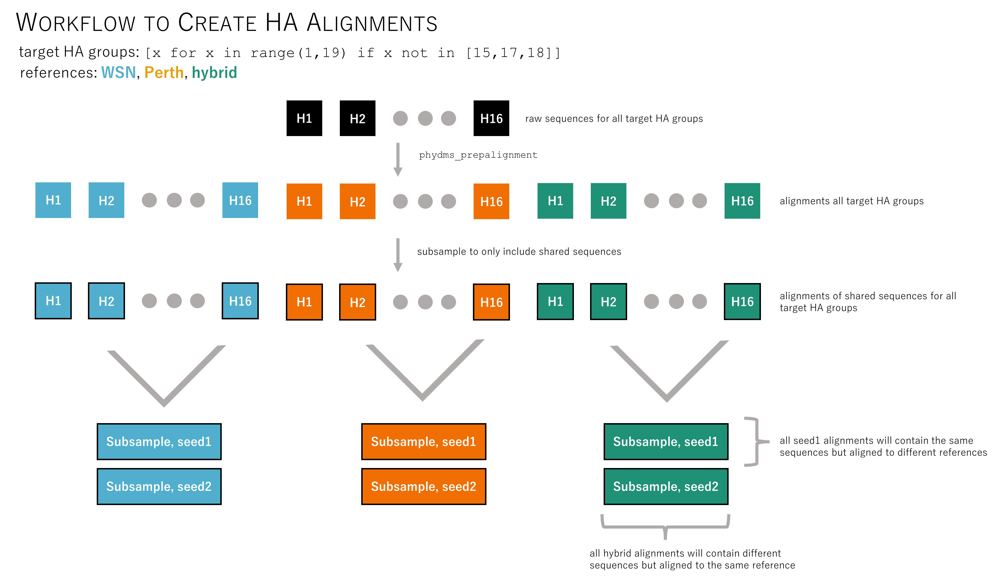

# HA data

This directory contains the pre- and post-processed influenza HA sequences.

## Organization
The directory is organized as follows

[`./raw/`](./raw/): Raw sequences from the [Influenza Virus Resource Database](https://www.ncbi.nlm.nih.gov/genomes/FLU/Database/nph-select.cgi?go=database).  
[`./references/`](./references/): Files need to run the analysis other than the IVR sequences (DMS reference sequences, required_seqs, preferences, etc.)
[`./aligned/`](./aligned/): Sequences aligned to DMS references in [`./references/`](./references/)    
[`./shared/`](.shared/): Aligned sequences which are shared between all three sequences   
[`./subsampled/`](./subsampled/): Final alignments which contain a) all target HA groups b) aligned to DMS references c) subsampled to five sequences per HA group with no more than one sequence per year and d) contain all of the required sequences.

## Code
The code to produce the alignments found in [`./aligned/`](./aligned/), [`.shared/`](.shared/), and [`./subsampled/`](./subsampled/) is found in the [`snakemake`](http://snakemake.readthedocs.io/en/stable/) file [`Snakefile`](Snakefile).
To run the code, type `snakemake` in *this* directory.

Here is a workflow of the `Snakefile`

### Notes
• I used the standard `phydms_prepalignment` run *except* I set a very low `minidentity` threshold of 0.3.
