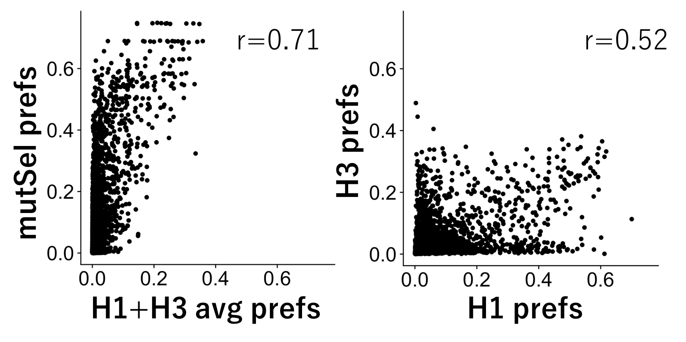
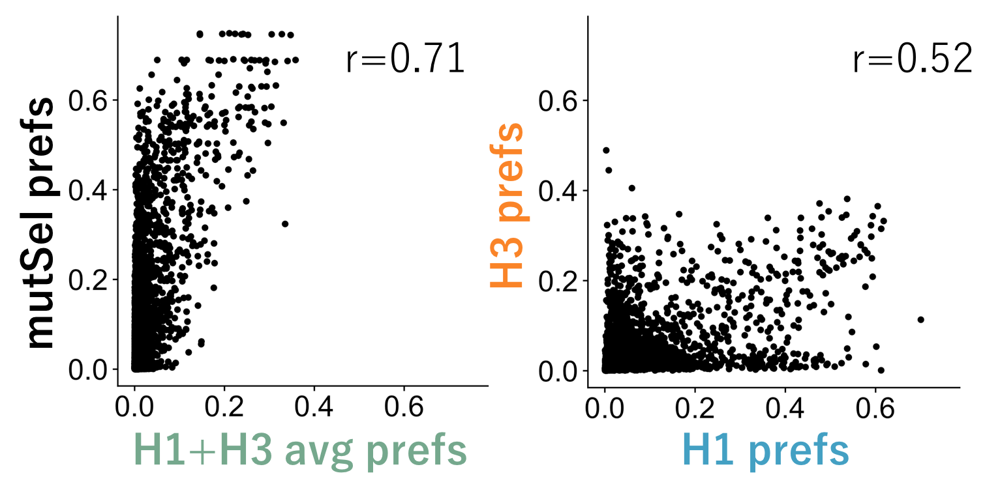
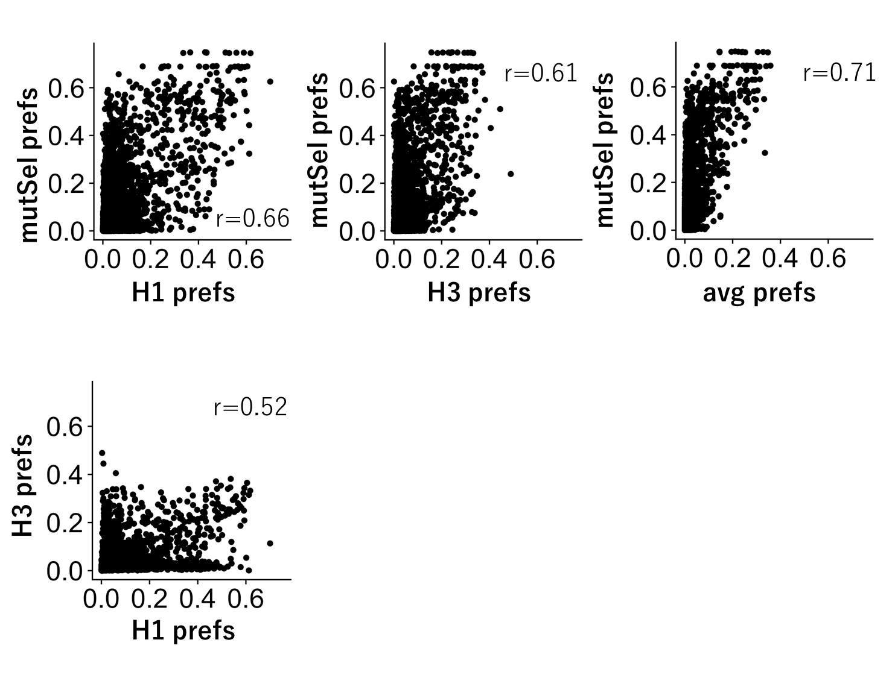
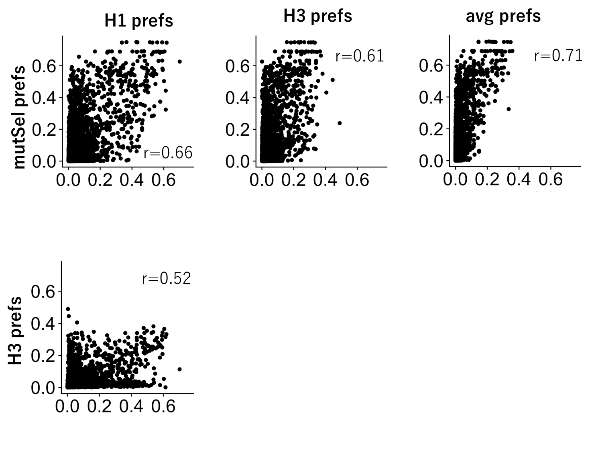
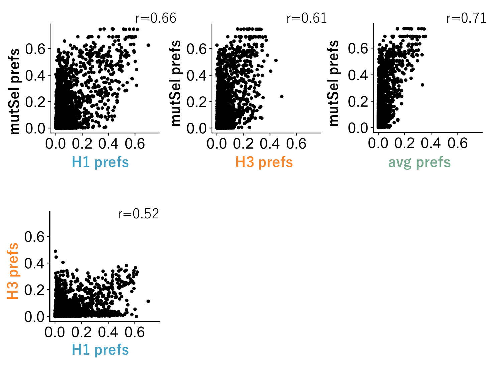

# Possible figure layouts for mutSel vs. DMS prefs correlations

For the final section of the paper, we want to show the correlation between the preferences measured by our DMS experiments and the preferences inferred/sampled by the mutSel model as implemented in `phylobayes`. Specifically, we want to show that the H1+H3 average preferences are better correlated to the mutSel preferences than the H1 and H3 preferences are to each other.

Below are the rough drafts of possible correlation layouts. There are two main layouts: 1) small layout with just the two correlations I mentioned above and 2) larger layout which correlates the mutSel preferences with *all* of the DMS prefs.

**My favorite is alt 2.**  If we decide to show the corelations between mutSel and H1/H3 then my favorite is alt 6.

## Small layout

This layout just shows the mutSel vs. H1+H3 avg and H1 vs. H3.

### Alt 1

This figure has only black text  

### Alt 2

This is the same as above but carries through the color coding from the other results sections  

## Large layout

This layout shows the correlation of mutSel vs. all DMS and H1 vs H3

### Alt 3

This figure has all plot axes labeled in black and white  

### Alt 4

This figure has all plot axes labeled in black and white but the pearson correlation coefficients are inside the plot

### Alt 5

This figure has the minimum number of axes labeled  

### Alt 6

This figure is the same as Alt 3 except the axes are color coded  

