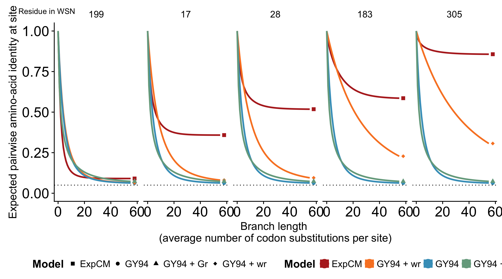

# Determining the correct models for the "decay to stationary state" figure

## Current issue

During my in prep journal club you mentioned that the $\omega_r$ values for the sites in the "decay to stationary state" figure looked very low.
For instance, the $\omega_r$ value for the most mutationally tolerant site was 0.18.
I looked back at the formula and I think that I found a bug in the way we were calculating this value.

## Calculating the $\omega_r$ value

### Formula

$\omega_{r} = \frac{\sum_{x} \sum_{y \in N_x} {p_{r,x} \times P_{r,xy}}}{\sum_{x} \sum_{y \in N_x} {p_{r,x} \times Q_{xy}}}$  
where $p_{r,x}$ is the stationary state of the ExpCM at site $r$ and codon $x$, $P_{r,xy}$ is the substitution rate from codon $x$ to codon $y$ at site $r$, $Q_{xy}$ is the mutation rate from codon $x$ to codon $y$, and $N_x$ is the set of codons that are nonsynonymous to codon $x$ and differ from codon $x$ by only one nucleotide.

### Old way

Previously, I was calculating the value by taking the exact value of $F_{r,xy}$ from the `phydms` model.
However, our ExpCM has a gene-wide $\omega$ value and the model in Stephanie Spielman's paper did not.
I think this is why the values were so low.

### New way

Now, I replace $F_{r,xy}$ with $\frac{F_{r,xy}}{\omega}$ so the calculation takes into account the scaled preferences but not the gene-wide $\omega$.

The $\omega_r$ values make more sense now.
For a mutationally tolerant site, the $\omega_r$ value is 0.92.

## Models for the figure

I updated the calculation in `phydms` (I haven't pushed the changes yet) but then ran into a problem with figure.

### Old way of defining "YNGKP + $\omega_r$"

For this figure, I define a "YNGKP + $\omega_r$" model where the $\omega$ value for each site is the $\omega_r$ from the ExpCM but I think the values are too high now.

$P_{xy} = \kappa \mu \omega_r \Phi_{y}$ (non-syn, transition case)

Here is the resulting plot (raw, unedited)

### New way of defining "YNGKP + $\omega_r$"

I tried defining the "YNGKP + $\omega_r$" with both the $\omega$ and $\omega_r$ value and it looked much "better". 

